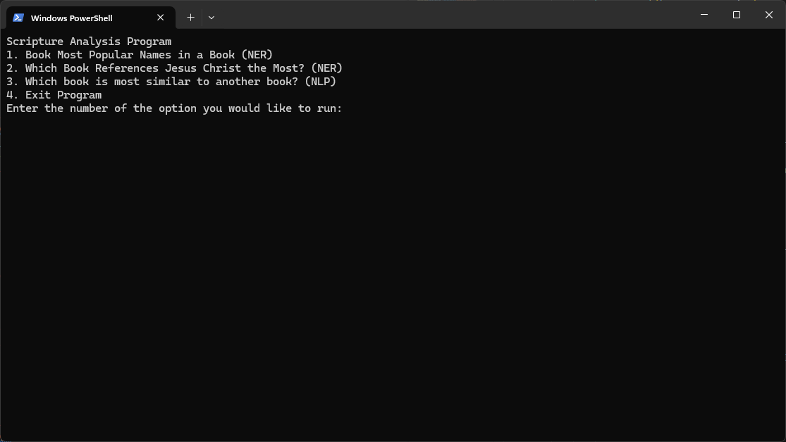
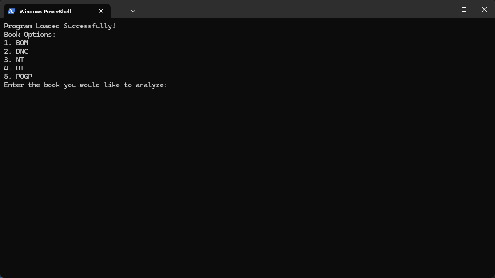
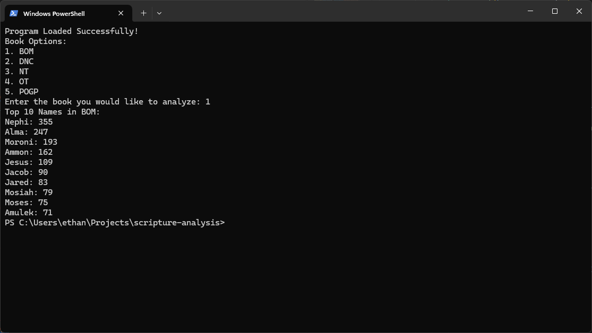
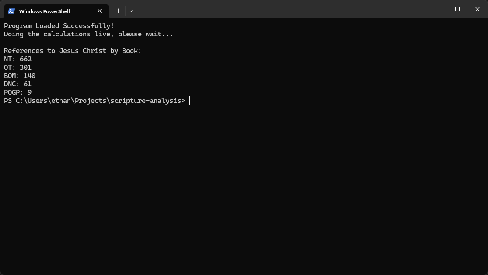
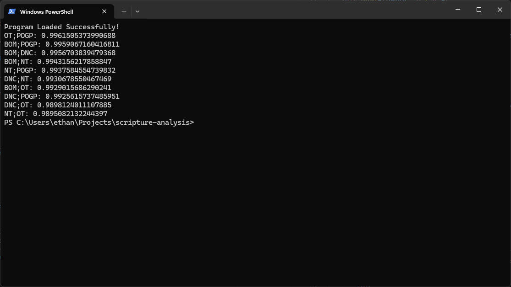

<h1>Scripture Analysis Documentation</h1>

### Quick Links

-   [Origional Project Plan](./docs/plan.md)
-   [Questions to Answer](#questions)
-   [Files Needed](#files)
-   [Menu Overview](#menu)

## Questions 

For this project there were two guiding questions that I set out to answer.

-   Which book references Jesus the most?
-   Which two books are most simelar to eachother?

In an effort to answer these questions I user natural language processing (NLP) to compare the books and verses to eachother, as well as perform named entity recognition (NER) to identify the names of people and places mentioned in the text.

## Files 

-   [`scripture_analysis.py`](./scripture_analysis.py)
    -   This file contains the CLI user interface, as well as the main function that are performing the analysis.
-   [`scripture_processing.py`](./scripture_processing.py)
    -   This file contains the functions that are used to process the text of the books and verses. Many of these functions are used to clean the text and prepare it for analysis, and are shared by primary funcitons in `scripture_analysis.py`.
-   [`data`](./data)

    -   [`/output`](./data/output)
        -   Processed data that was stored in a dictionary is saved as a `.json` file here.
    -   [`/processed`](./data/processed)

        -   Output files are saves as `.pkl` files in this directory.

    -   [`/scriptures`](./data/scriptures)
        -   The raw data for the scriptures is sotred in regulary and flat JSON files here.

## Menu Overview 

This section will overview the menu with images. This is a terminal application, but much of the data is outputted into json files for later use. The menu is as follows:

### Main Menu

### Most Popular Names Manu

### Most Popular Places Results

### Named Entity Recognition for Jesus Christ

### Most Similar Books Results (Ordered)

